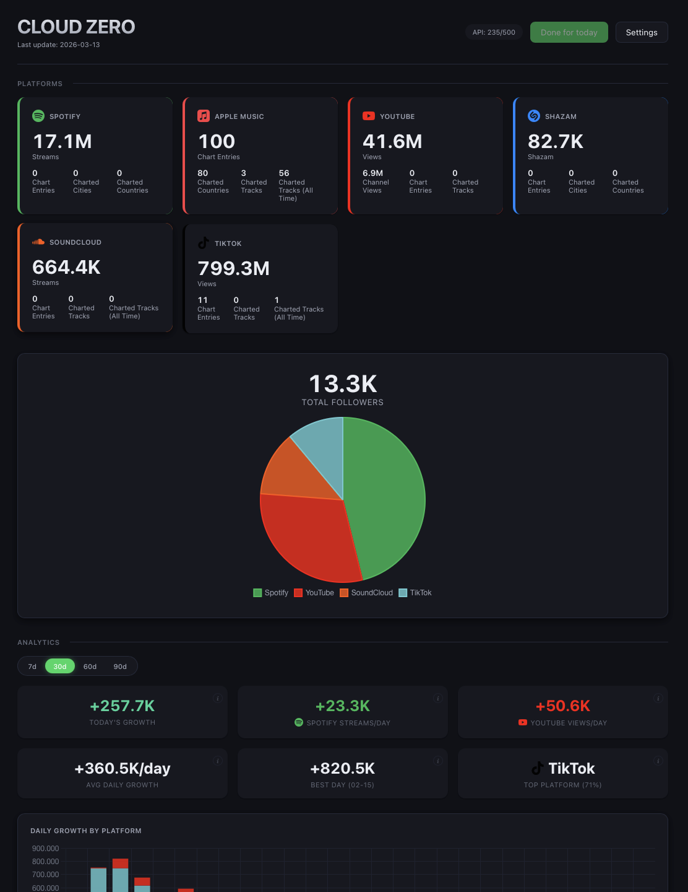
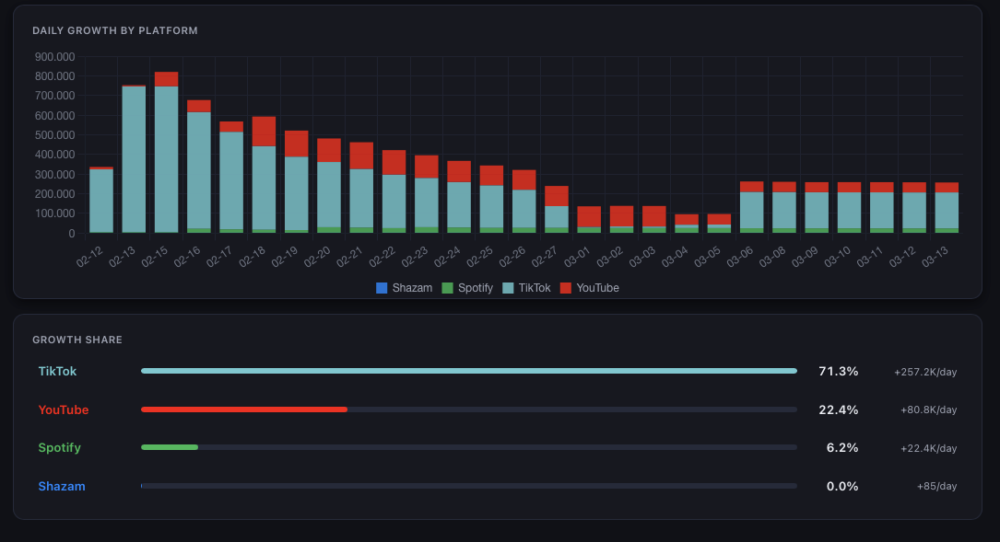

# Streaming Stats

A cross-platform desktop app that tracks streaming stats for music artists across 9 platforms. Powered by the [Songstats API](https://rapidapi.com/songstats-app-songstats-app-default/api/songstats) **free tier** (500 requests/month — enough for daily tracking of one artist). Built with Tauri 2 (Rust + React).

<p align="center">
  
</p>

<p align="center">
  <a href="https://github.com/twentymls/streaming-stats/releases/download/v0.1.0-beta.6/Streaming.Stats_0.1.0-beta.6_aarch64.dmg">
    
  </a>
</p>

## Download

**[Download the latest release](https://github.com/twentymls/streaming-stats/releases/download/v0.1.0-beta.6/Streaming.Stats_0.1.0-beta.6_aarch64.dmg)**

### macOS

1. Download the `.dmg` file above
2. Open the DMG and drag **Streaming Stats** to your Applications folder
3. **Before opening for the first time**, open Terminal and run:
   ```
   xattr -cr "/Applications/Streaming Stats.app"
   ```
4. Now open the app normally

> **Why is this needed?** The app is not yet signed with an Apple Developer certificate (yet), so macOS blocks it by default. The command above removes the download quarantine flag. This is a one-time step — you won't need to do it again.

> Windows, iOS, and Android builds are coming soon.

## Supported Targets

| Platform | Status |
|----------|--------|
| macOS | Stable |
| Windows | Supported |
| iOS | Supported |
| Android | Supported |

## Supported Music Platforms

Spotify, Apple Music, YouTube, TikTok, Deezer, Amazon Music, Shazam, SoundCloud, Instagram

## Screenshots

<details>
<summary><b>Dashboard</b> — Platform cards, followers pie chart, KPI cards, daily growth chart, growth share</summary>
<br />
<p align="center">
  
  
</p>
</details>

<details>
<summary><b>Spotify Detail</b> — Monthly listeners, top tracks, trend charts</summary>
<br />
<p align="center">
  
</p>
</details>

<details>
<summary><b>TikTok Detail</b> — Views, top tracks, top curators</summary>
<br />
<p align="center">
  
</p>
</details>

## How It Works

1. **Setup** — Enter your RapidAPI key (instructions and links provided) and a Spotify artist ID/URL. The app validates both before proceeding.
2. **Daily tracking** — The app automatically fetches stats on launch (max 1x/day). All data is stored locally in a SQLite database.
3. **Dashboard** — View current stats per platform, KPI cards (daily growth, Spotify streams/day, YouTube views/day), a stacked bar chart of daily growth by platform, and a growth share breakdown. Filter by 7/30/60/90 day periods. Toggle smoothing for 7-day rolling averages.
4. **Platform detail** — Click any platform card to see full stats, top tracks with Songstats links, trend charts, and (for TikTok) top curators. All detail data is served from the local cache — no API calls on view.
5. **Backfill** — One-time download of up to 90 days of historical data from Songstats (Settings > Backfill historic data).
6. **Cloud Sync** (optional) — Sign in with email/password in Settings to sync data to Supabase. A read-only PWA lets you view stats on your phone.

### Data & Privacy

All data is stored **locally on your machine** by default:
- Stats in a SQLite database (`streaming_stats.db`)
- Settings (API key, artist ID) in Tauri's encrypted store

No data is sent anywhere except the Songstats API calls to fetch stats.

**Optional Cloud Sync**: If you enable Cloud Sync (Settings > Cloud Sync), your stats are also pushed to a Supabase database. Data is protected by Row Level Security — only your authenticated account can access your data. Your RapidAPI key is stored in the Supabase database (encrypted at rest) so the server-side fallback fetcher can keep your data fresh when the desktop app is off.

### API Usage

The app uses the Songstats API via RapidAPI. The **BASIC plan** allows 500 requests/month. The daily update uses ~16 API calls (9 platform stats + 6 top tracks + 1 top curators). Per-track stats are refreshed weekly (~10 calls). Once-a-day updates keep monthly usage under 500 calls. Top tracks and curators are stored in the local DB during the daily fetch, so detail views read directly from the database without making API calls. A backfill uses ~9 calls. The dashboard shows your current monthly usage.

A 1.2 second delay is added between platform requests to stay within the per-second rate limit.

## Cloud Sync & Mobile PWA

The desktop app can optionally sync data to [Supabase](https://supabase.com/) (free tier). A read-only Progressive Web App (PWA) reads from Supabase, giving you mobile access without the App Store.

### How it works

1. **Desktop syncs to cloud** — After each daily fetch, the app pushes stats to Supabase (best-effort, non-blocking). You can also trigger a full history sync from Settings.
2. **Server-side fallback** — A Supabase Edge Function runs daily. If the desktop hasn't synced in 24 hours, the Edge Function fetches from Songstats directly so the PWA never shows stale data.
3. **PWA on your phone** — Open the PWA URL in Safari, tap "Add to Home Screen". It looks and works like a native app (standalone mode, dark theme, safe-area support).

### Self-hosting the PWA

1. Create a [Supabase](https://supabase.com/) project (free tier)
2. Run the migration in `supabase/migrations/001_initial_schema.sql` in the Supabase SQL editor
3. Enable Email/Password auth in the Supabase dashboard
4. Set environment variables:
   ```
   VITE_SUPABASE_URL=https://your-project.supabase.co
   VITE_SUPABASE_ANON_KEY=your-anon-key
   ```
5. Build the PWA: `npm run build:pwa`
6. Deploy `dist-pwa/` to any static host (Vercel, Netlify, etc.)

See `vercel.json` for the SPA rewrite config if deploying to Vercel.

### Edge Function (optional)

Deploy the fallback fetcher from `supabase/functions/daily-fetch/`:
```bash
supabase functions deploy daily-fetch
```
Set a daily cron trigger via `pg_cron` in the Supabase SQL editor.

## Local Development Setup

### Prerequisites

- [Node.js](https://nodejs.org/) (v18+)
- [Rust](https://rustup.rs/) (stable toolchain)
- Tauri system dependencies — see [Tauri Prerequisites](https://v2.tauri.app/start/prerequisites/)
- A [RapidAPI](https://rapidapi.com/) account with a Songstats API subscription

**For Windows development:**
- [WebView2](https://developer.microsoft.com/en-us/microsoft-edge/webview2/) (included in Windows 11; auto-installed on Windows 10 by the NSIS installer)
- [Visual Studio Build Tools](https://visualstudio.microsoft.com/visual-cpp-build-tools/) with the "Desktop development with C++" workload

**For iOS development:**
- Xcode 15+
- CocoaPods: `sudo gem install cocoapods`
- Rust targets: `rustup target add aarch64-apple-ios x86_64-apple-ios aarch64-apple-ios-sim`

**For Android development:**
- Android Studio with NDK v26+ (install via SDK Manager)
- Environment variables: `ANDROID_HOME`, `NDK_HOME`
- Rust targets: `rustup target add aarch64-linux-android armv7-linux-androideabi i686-linux-android x86_64-linux-android`

### Install

```bash
git clone <repo-url>
cd streaming-stats
npm install
```

### Add Cargo to PATH (one-time)

Rust/Cargo is installed at `~/.cargo/bin` but isn't on the default shell PATH. Add it permanently:

```bash
echo 'export PATH="$HOME/.cargo/bin:$PATH"' >> ~/.zshrc
source ~/.zshrc
```

After this, all commands below work without the `export PATH` prefix.

### Run in dev mode

```bash
npx tauri dev
```

This starts the Vite dev server on `localhost:5173` and compiles the Rust backend. The app window opens automatically with hot-reload for frontend changes.

```bash
# iOS Simulator
npx tauri ios dev

# Android Emulator
npx tauri android dev

# PWA dev server (no Tauri backend, reads from Supabase)
npm run dev:pwa
```

### Build for production

```bash
# Desktop (macOS)
npx tauri build --bundles app

# Desktop (Windows) — must be run on a Windows machine
npx tauri build --bundles nsis

# iOS
npx tauri ios build

# Android
npx tauri android build

# PWA (outputs to dist-pwa/)
npm run build:pwa
```

Desktop output:
```
src-tauri/target/release/bundle/macos/Streaming Stats.app              # macOS
src-tauri/target/release/bundle/nsis/Streaming Stats_0.1.0_x64-setup.exe  # Windows
```

### Tests

```bash
npm test                                        # Frontend (Vitest)
cd src-tauri && cargo test                      # Backend (Rust)
```

### Lint & Format

```bash
npm run lint:fix && npm run format              # Frontend
cd src-tauri && cargo clippy && cargo fmt       # Backend
```

## Project Structure

```
streaming-stats/
├── src/                        # React 19 frontend (TypeScript)
│   ├── components/
│   │   ├── Dashboard.tsx       # Main view with stats, charts, auto-fetch
│   │   ├── PlatformCard.tsx    # Individual platform stat card
│   │   ├── PlatformDetail.tsx  # Detail view with stats, top tracks, curators
│   │   ├── KpiRow.tsx          # 6-card KPI summary row
│   │   ├── DailyGrowthChart.tsx # Stacked bar chart by platform
│   │   ├── GrowthShare.tsx     # Platform growth share bars
│   │   ├── StatsChart.tsx      # Trend line chart
│   │   ├── Setup.tsx           # 3-step onboarding flow
│   │   ├── Settings.tsx        # Config, platform toggles, cloud sync, backfill
│   │   └── LoginPage.tsx       # PWA email/password login
│   ├── lib/
│   │   ├── songstats-api.ts    # Songstats API client with retry logic
│   │   ├── songstats-fields.ts # Shared field mappings (desktop + Edge Function)
│   │   ├── database.ts         # Tauri IPC wrappers for Rust DB commands
│   │   ├── database-web.ts     # Supabase-backed database (PWA)
│   │   ├── settings.ts         # Encrypted settings store (desktop)
│   │   ├── settings-web.ts     # Supabase-backed settings (PWA)
│   │   ├── supabase.ts         # Supabase client singleton
│   │   ├── sync.ts             # Cloud sync (desktop → Supabase)
│   │   ├── tauri-stubs.ts      # No-op stubs for PWA build
│   │   ├── utils.ts            # Data aggregation and formatting
│   │   ├── constants.ts        # Platform names, colors, stat labels
│   │   └── types.ts            # TypeScript interfaces
│   ├── PwaApp.tsx              # PWA root (auth gate + read-only dashboard)
│   ├── main-pwa.tsx            # PWA entry point
│   └── styles/
│       └── globals.css         # Dark theme with CSS custom properties
├── src-tauri/                  # Rust backend (Tauri 2)
│   └── src/
│       ├── lib.rs              # App setup (plugins, tray, DB pool)
│       ├── commands.rs         # 16 Tauri IPC commands
│       ├── db.rs               # SQLite pool and migrations
│       ├── models.rs           # Serde models for IPC boundary
│       └── error.rs            # Error types
├── supabase/                   # Supabase cloud infrastructure
│   ├── migrations/
│   │   └── 001_initial_schema.sql  # Postgres schema (RLS + indexes)
│   └── functions/
│       └── daily-fetch/        # Edge Function (server-side fallback fetcher)
├── public-pwa/                 # PWA static assets (manifest, service worker)
├── vite.config.pwa.ts          # PWA Vite config (aliases Tauri → web modules)
├── index-pwa.html              # PWA HTML entry point
├── vercel.json                 # Vercel SPA rewrite config
├── docs/                       # Detailed documentation
└── package.json
```

See [`docs/`](docs/README.md) for detailed documentation on architecture, database schema, API integration, and more.

## Tech Stack

| Layer | Technology |
|-------|-----------|
| Platforms | macOS, Windows, iOS, Android |
| App framework | [Tauri v2](https://v2.tauri.app/) |
| Frontend | React 19, TypeScript 5.9, Vite 6 |
| Backend | Rust (Edition 2021) |
| Database | SQLite (via sqlx) — local; Supabase (Postgres) — cloud |
| Settings | tauri-plugin-store (encrypted) |
| HTTP | tauri-plugin-http (reqwest) |
| Cloud sync | [Supabase](https://supabase.com/) (auth, database, Edge Functions) |
| Charts | Chart.js + react-chartjs-2 |
| Dates | date-fns 4 |
| API | [Songstats via RapidAPI](https://rapidapi.com/songstats-app-songstats-app-default/api/songstats) |
