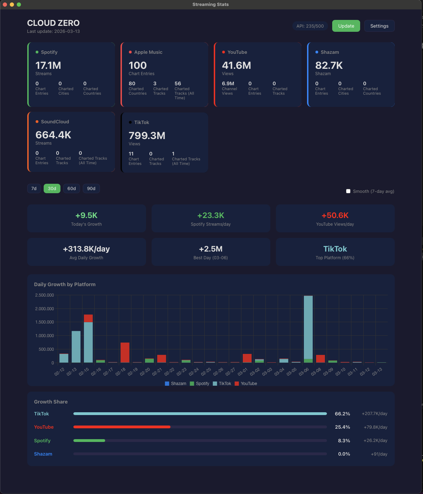
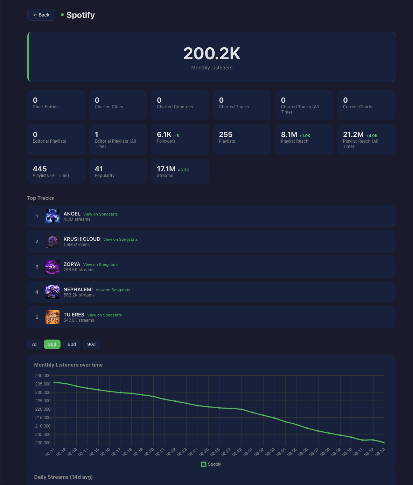
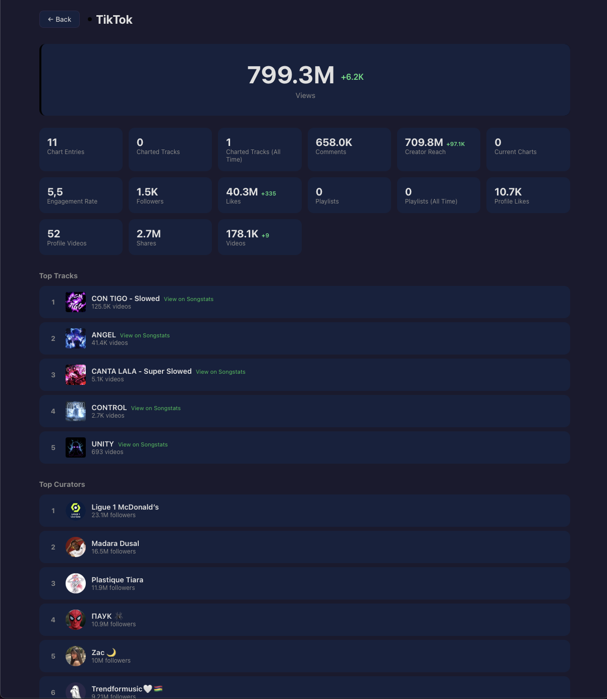

# Streaming Stats

A desktop app that tracks streaming stats for music artists across 8 platforms using the [Songstats API](https://rapidapi.com/songstats-app-songstats-app-default/api/songstats). Built with Tauri (Rust + React).

<p align="center">
  
</p>

## Supported Platforms

Spotify, Apple Music, YouTube, TikTok, Deezer, Amazon Music, Shazam, SoundCloud

## Screenshots

<details>
<summary><b>Dashboard</b> — KPI cards, daily growth chart, platform share breakdown</summary>
<br />
<p align="center">
  
</p>
</details>

<details>
<summary><b>Spotify Detail</b> — Monthly listeners, top tracks, trend charts</summary>
<br />
<p align="center">
  
</p>
</details>

<details>
<summary><b>TikTok Detail</b> — Views, top tracks, top curators</summary>
<br />
<p align="center">
  
</p>
</details>

## How It Works

1. **Setup** — Enter your RapidAPI key and a Spotify artist ID/URL. The app validates both before proceeding.
2. **Daily tracking** — The app automatically fetches stats on launch (max 1x/day). All data is stored locally in a SQLite database.
3. **Dashboard** — View current stats per platform, KPI cards (daily growth, Spotify streams/day, YouTube views/day), a stacked bar chart of daily growth by platform, and a growth share breakdown. Filter by 7/30/60/90 day periods. Toggle smoothing for 7-day rolling averages.
4. **Platform detail** — Click any platform card to see full stats, top tracks with Songstats links, trend charts, and (for TikTok) top curators. All detail data is served from the local cache — no API calls on view.
5. **Backfill** — One-time download of up to 90 days of historical data from Songstats (Settings > Backfill historic data).

### Data & Privacy

All data is stored **locally on your machine**:
- Stats in a SQLite database (`streaming_stats.db`)
- Settings (API key, artist ID) in Tauri's encrypted store

No data is sent anywhere except the Songstats API calls to fetch stats.

### API Usage

The app uses the Songstats API via RapidAPI. The **BASIC plan** allows 500 requests/month. The daily update uses ~15 API calls (8 platform stats + 6 top tracks + 1 top curators). Per-track stats are refreshed weekly (~10 calls). Once-a-day updates keep monthly usage under 500 calls. Top tracks and curators are cached in the local DB so detail views never make API calls. A backfill uses ~8 calls. The dashboard shows your current monthly usage.

A 1.2 second delay is added between platform requests to stay within the per-second rate limit.

## Local Development Setup

### Prerequisites

- [Node.js](https://nodejs.org/) (v18+)
- [Rust](https://rustup.rs/) (stable toolchain)
- Tauri system dependencies — see [Tauri Prerequisites](https://v2.tauri.app/start/prerequisites/)
- A [RapidAPI](https://rapidapi.com/) account with a Songstats API subscription

### Install

```bash
git clone <repo-url>
cd streaming-stats
npm install
```

### Run in dev mode

```bash
export PATH="$HOME/.cargo/bin:$PATH" && npx tauri dev
```

This starts the Vite dev server on `localhost:5173` and compiles the Rust backend. The app window opens automatically with hot-reload for frontend changes.

### Build for production

```bash
export PATH="$HOME/.cargo/bin:$PATH" && npx tauri build --bundles app
```

The built app is output to:
```
src-tauri/target/release/bundle/macos/Streaming Stats.app
```

### Tests

```bash
npm test                                                    # Frontend (Vitest)
export PATH="$HOME/.cargo/bin:$PATH" && cd src-tauri && cargo test   # Backend (Rust)
```

### Lint & Format

```bash
npm run lint:fix && npm run format                          # Frontend
export PATH="$HOME/.cargo/bin:$PATH" && cd src-tauri && cargo clippy && cargo fmt  # Backend
```

## Project Structure

```
streaming-stats/
├── src/                        # React 19 frontend (TypeScript)
│   ├── components/
│   │   ├── Dashboard.tsx       # Main view with stats, charts, auto-fetch
│   │   ├── PlatformCard.tsx    # Individual platform stat card
│   │   ├── PlatformDetail.tsx  # Detail view with stats, top tracks, curators
│   │   ├── KpiRow.tsx          # 6-card KPI summary row
│   │   ├── DailyGrowthChart.tsx # Stacked bar chart by platform
│   │   ├── GrowthShare.tsx     # Platform growth share bars
│   │   ├── StatsChart.tsx      # Trend line chart
│   │   ├── Setup.tsx           # 3-step onboarding flow
│   │   └── Settings.tsx        # Config, platform toggles, backfill
│   ├── lib/
│   │   ├── songstats-api.ts    # Songstats API client with retry logic
│   │   ├── database.ts         # Tauri IPC wrappers for Rust DB commands
│   │   ├── settings.ts         # Encrypted settings store
│   │   ├── utils.ts            # Data aggregation and formatting
│   │   ├── constants.ts        # Platform names, colors, stat labels
│   │   └── types.ts            # TypeScript interfaces
│   └── styles/
│       └── globals.css         # Dark theme with CSS custom properties
├── src-tauri/                  # Rust backend (Tauri 2)
│   └── src/
│       ├── lib.rs              # App setup (plugins, tray, DB pool)
│       ├── commands.rs         # 16 Tauri IPC commands
│       ├── db.rs               # SQLite pool and migrations
│       ├── models.rs           # Serde models for IPC boundary
│       └── error.rs            # Error types
├── docs/                       # Detailed documentation
└── package.json
```

See [`docs/`](docs/README.md) for detailed documentation on architecture, database schema, API integration, and more.

## Tech Stack

| Layer | Technology |
|-------|-----------|
| Desktop framework | [Tauri v2](https://v2.tauri.app/) |
| Frontend | React 19, TypeScript 5.9, Vite 6 |
| Backend | Rust (Edition 2021) |
| Database | SQLite (via sqlx) |
| Settings | tauri-plugin-store (encrypted) |
| HTTP | tauri-plugin-http (reqwest) |
| Charts | Chart.js + react-chartjs-2 |
| Dates | date-fns 4 |
| API | [Songstats via RapidAPI](https://rapidapi.com/songstats-app-songstats-app-default/api/songstats) |
